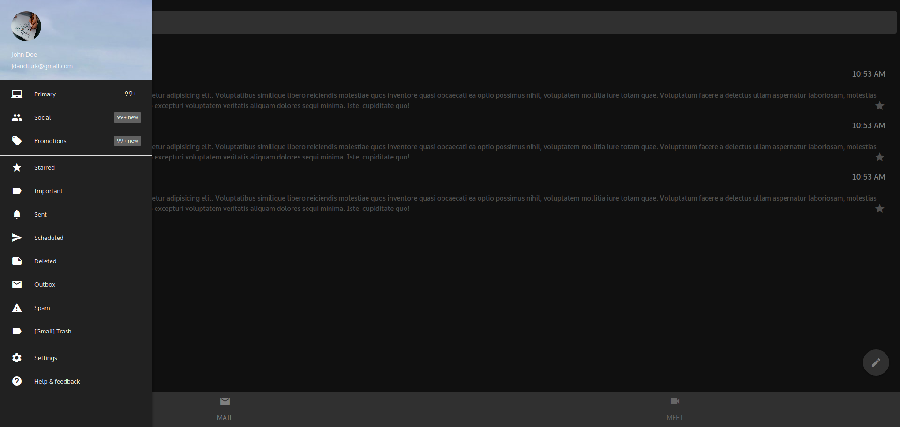
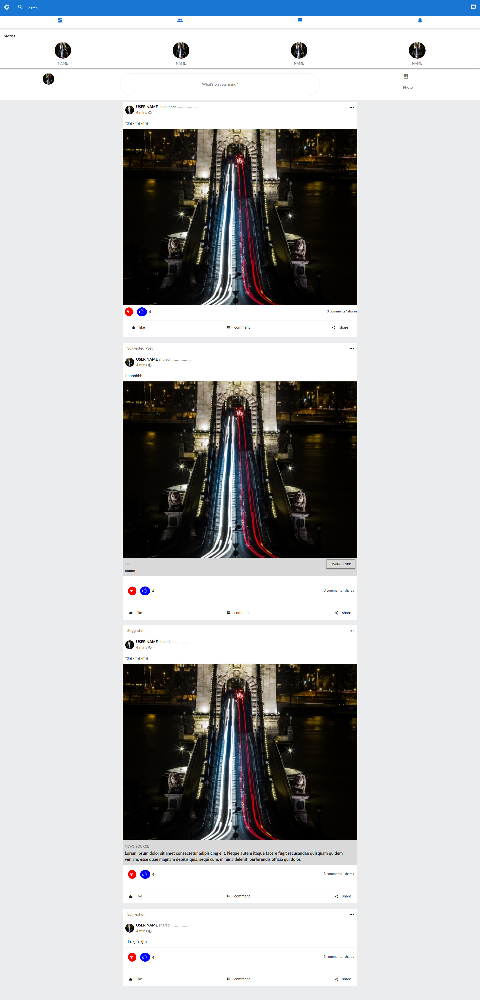
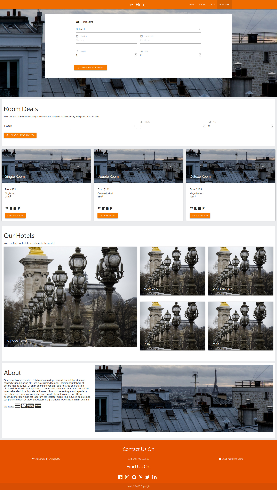
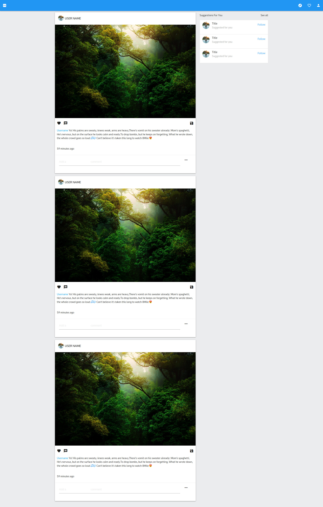
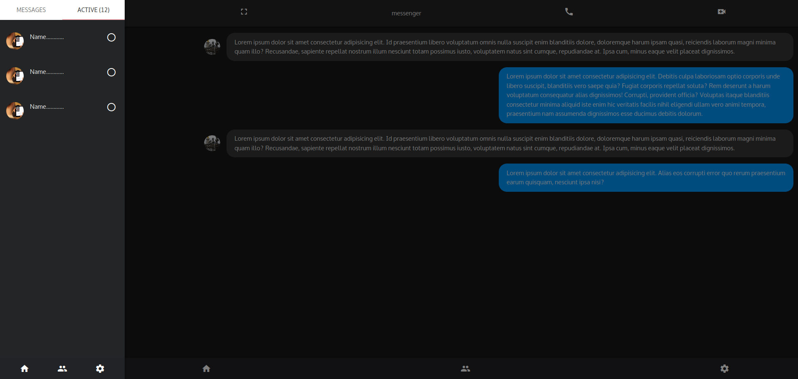
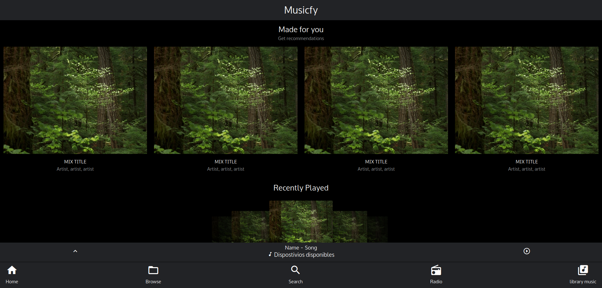
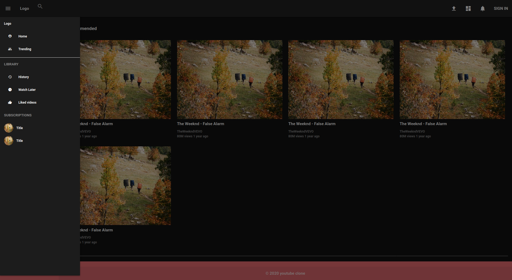

<h1 align="center">MaterializeCSS projects</h1>

  

<h2>Table of content</h2>

- [Tools used](#tools-used)
- [Email Gmail clone](#email-gmail-clone)
- [Facebook Clone](#facebook-clone)
- [Hotel](#hotel)
- [Instagram Clone](#instagram-clone)
- [Messenger Clone](#messenger-clone)
- [Spotify Clone](#spotify-clone)
- [Youtube](#youtube)

## Tools used

## Email Gmail clone

<h3 align="center">Desktop View</h3>

## Facebook Clone

<h3 align="center">Desktop View</h3>

## Hotel

<h3 align="center">Desktop View</h3>

## Instagram Clone

<h3 align="center">Desktop View</h3>

## Messenger Clone

<h3 align="center">Desktop View</h3>

## Spotify Clone

<h3 align="center">Desktop View</h3>

## Youtube

<h3 align="center">Desktop View</h3>

